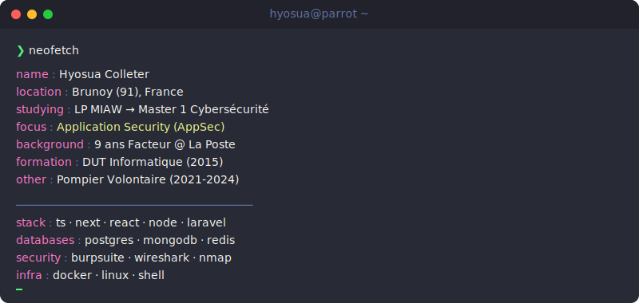
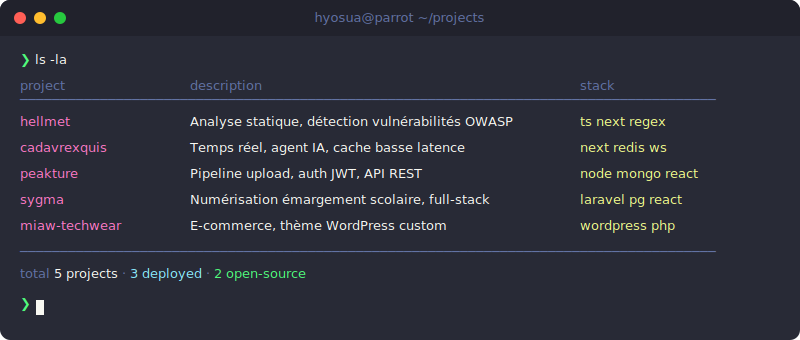

<picture>
  
</picture>

<br>

```zsh
❯ ls -la ~/projects/
```

<picture>
  
</picture>

<br>

```zsh
❯ cat ~/.hacking-labs
```

<p>
  <a href="https://app.hackthebox.com/"></a>
  <a href="https://tryhackme.com/"></a>
  <a href="https://www.root-me.org/"></a>
</p>

```zsh
❯ echo $LINKS
```

<p>
  <a href="https://hyosua.fr"></a>
  <a href="mailto:colleterhyosua@gmail.com"></a>
</p>

---
